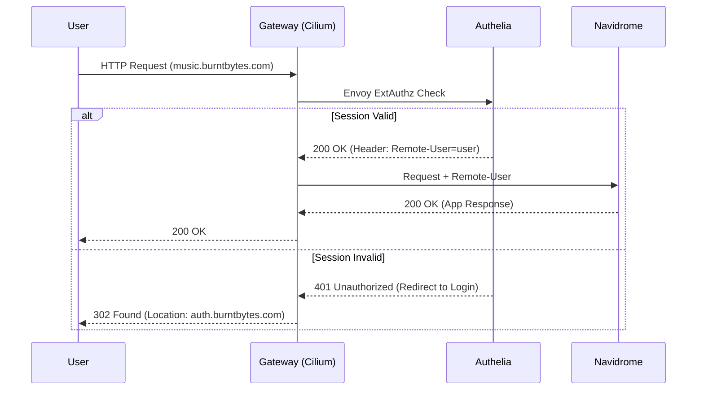

# Navidrome

## 1. Overview
Navidrome is an open-source, web-based music collection server and streamer. It gives you the freedom to listen to your music collection from any browser or mobile device. It is compatible with the Subsonic API, allowing you to use a wide variety of client applications.

## 2. Architecture
Navidrome is deployed as a standard Kubernetes `Deployment` with a single replica in the `navidrome-prod` (and `navidrome-stage`) namespace.
- **Storage**:
  - **Data**: Uses a PersistentVolumeClaim (`navidrome-data-pvc`) backed by the `synology-iscsi` storage class to store its SQLite database, cache, and configuration.
  - **Music**: Uses an NFS PersistentVolume (`navidrome-music-pvc`) to mount the music library directly from the Synology NAS (`/volume1/family/audio/music`).
- **Security Context**: The pod runs as UID `1028` to match the owner of the music directory on the Synology NAS, ensuring read access to the NFS share.
- **Networking**: Exposed via Cilium Gateway API (`HTTPRoute`).

## 3. URLs
- **Staging**: https://music.stage.burntbytes.com
- **Production**: https://music.burntbytes.com

## 4. Configuration
- **Environment Variables**:
  - `ND_DATAFOLDER`: `/data`
  - `ND_MUSICFOLDER`: `/music`
  - `ND_LOGLEVEL`: `info`
  - `ND_SCANSCHEDULE`: `1h` (Scans for new music every hour)
  - `ND_SESSIONTIMEOUT`: `24h`
- **ConfigMaps/Secrets**:
  - `navidrome-lastfm` (Secret): Contains Last.fm API credentials (`ND_LASTFM_APIKEY`, `ND_LASTFM_SECRET`) used for fetching album art, artist biographies, and enabling user scrobbling. Managed via SOPS.

## 5. Usage Instructions
- **Web UI**: Navigate to the URL and log in. The first user created becomes the administrator.
- **Subsonic Clients**: You can use any Subsonic-compatible client (e.g., Symfonium on Android, play:Sub on iOS, Sonixd on Desktop). Point the client to the Navidrome URL and use your credentials.

## 6. Testing
To verify Navidrome is working:
1. Navigate to the web UI and ensure the music library loads.
2. Play a song and verify it streams correctly.
3. Verify the pod is running: `kubectl get pods -n navidrome-prod`

## 7. Monitoring & Alerting
- **Metrics**: Navidrome does not expose Prometheus metrics natively.
- **Logs**: Check the pod logs for library scan errors or Last.fm API issues:
  ```bash
  kubectl logs -n navidrome-prod deploy/navidrome
  ```

## 8. Disaster Recovery
- **Backup Strategy**:
  - **Music**: The NFS share (`/volume1/family/audio/music`) is backed up natively on the Synology NAS.
  - **Data**: The `navidrome-data-pvc` contains the SQLite database (user accounts, playlists, play counts). This is backed up via Synology Snapshot Replication.
- **Restore Procedure**:
  1. Restore the `navidrome-data` LUN via Synology DSM if necessary.
  2. Ensure the NFS music share is intact.
  3. Re-deploy the Navidrome manifests.

## 9. Troubleshooting
- **Music Not Showing Up**:
  - Verify the NFS volume is mounted correctly and the pod has read permissions (UID 1028).
  - Trigger a manual "Quick Scan" or "Full Scan" from the Navidrome web UI (Activity icon -> Quick Scan).
- **Last.fm Integration Failing**:
  - Verify the `navidrome-lastfm` secret contains valid API keys.
  - Check the pod logs for API rate limiting or authentication errors.

## 10. Authentication
Navidrome is configured to use Authelia for single sign-on (SSO). The authentication flow is handled by a globally injected Envoy `ext_authz` filter on the Cilium Gateway.

### Flow Diagram



### Configuration Details

- **Global Envoy Filter**: `infra/configs/gateway/cilium-envoy-config-production.yaml` defines the `ext_authz` filter pointing to Authelia.
- **Authelia Policy**: `apps/production/authelia/configuration.yaml` defines the rule for `music.burntbytes.com` (Policy: `one_factor`) which triggers the header injection.
- **Navidrome Config**: `ND_EXTAUTH_USERHEADER` is set to `Remote-User` and trusted proxies are configured via `ND_EXTAUTH_TRUSTEDSOURCES`.

See [Navidrome Documentation](https://www.navidrome.org/docs/getting-started/extauth-quickstart/) for more details on External Authentication.
