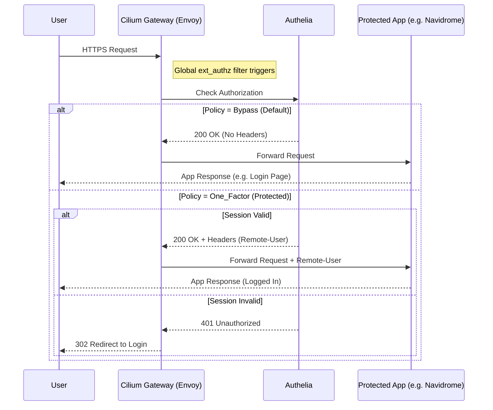

# Global Authentication Architecture (Gateway API + Authelia + Envoy)

This document describes the authentication strategy implemented on the Cilium Gateway API using Envoy `ext_authz` filters and Authelia. This architecture enables Single Sign-On (SSO) and header injection for applications that do not support OIDC natively (e.g., Navidrome).

## Problem Statement

Some applications require authentication via specific HTTP headers (like `Remote-User`) injected by a trusted reverse proxy, a pattern known as **Forward Authentication**. While Cilium Gateway API supports basic authentication policies, it lacks native support for complex header injection scenarios required by legacy or specific applications.

To solve this, we inject a raw Envoy filter configuration directly into the Cilium Gateway using `CiliumClusterwideEnvoyConfig`.

## Architecture Overview

We implement a **Global Forward Authorization** strategy:

1.  **Global Filter Injection**: A `CiliumClusterwideEnvoyConfig` resource injects an `ext_authz` filter into the Gateway's listener. This filter intercepts *every* HTTP request routed through the Gateway.
2.  **Authelia as Decision Engine**: The filter forwards metadata (headers, path, method) of every request to Authelia's backend (`api/authz/ext-authz`).
3.  **Bypass-by-Default Policy**: To prevent breaking existing OIDC applications (which handle their own authentication), Authelia is configured with a default policy of `bypass`.
4.  **Specific Protection**: Applications requiring header injection (like Navidrome) are explicitly protected by Authelia rules (e.g., `policy: one_factor`) which trigger the authentication flow and header injection.

### Request Flow



## Configuration Components

### 1. Envoy Filter (`infra/configs/gateway/cilium-envoy-config-*.yaml`)

The `CiliumClusterwideEnvoyConfig` (CEC) defines the `ext_authz` filter. It specifies:
- **Service**: The Gateway service to attach to.
- **Cluster**: The upstream Authelia service (local cluster DNS).
- **Failure Mode**: `failure_mode_allow: false` (fail closed if Authelia is down).
- **Headers**: Which headers to forward to Authelia and which to accept back (e.g., `Remote-User`).

### 2. Authelia Configuration (`apps/*/authelia/configuration.yaml`)

The policy must be inverted to support the global filter:
- `access_control.default_policy`: **Must be `bypass`**.
- Specific rules are added for apps requiring auth:
  ```yaml
  - domain: "music.burntbytes.com"
    policy: one_factor
  ```

### 3. Application Configuration

The application must be configured to trust the Gateway and read the injected header.
- **Navidrome Example**:
  - `ND_EXTAUTH_USERHEADER`: `Remote-User`
  - `ND_EXTAUTH_TRUSTEDSOURCES`: CIDRs of the Gateway/Cluster pod network.

## why not per-route filters?

Cilium Gateway API's implementation of HTTPRoute filters for `ext_authz` is limited or requires complex matching logic that is difficult to maintain with the standard K8s API. A global filter ensures a consistent security posture and simplifies the Gateway configuration, shifting the complexity to the Authelia policy engine—a specialized tool designed for exactly this purpose.
