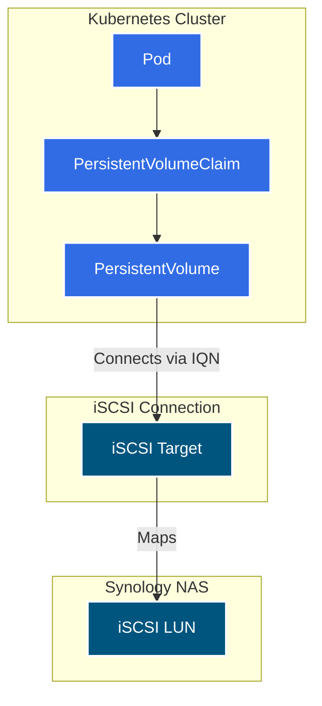

# Synology iSCSI Cleanup & Maintenance

This document outlines the process for maintaining and cleaning up orphaned iSCSI storage resources on the Synology NAS used by the Kubernetes cluster.

## Concepts: LUNs vs. Targets

In the context of Synology and Kubernetes iSCSI storage, there are two distinct components that work together:

1.  **LUN (Logical Unit Number)**: The actual "virtual hard drive" or block device where data is stored. It exists as a file or volume on the Synology filesystem.
2.  **Target**: The "network interface" or gateway that allows a client (Kubernetes Node) to connect to the LUN.

### The Relationship

A **Target** maps to one or more **LUNs**. The client connects to the Target (via its IQN) to access the LUN.



### The Orphan Problem

When a PVC/PV is deleted in Kubernetes, the CSI driver *should* automatically delete the corresponding LUN and Target on the Synology NAS. However, if the deletion is interrupted (e.g., node crash, forced deletion, network issue), these resources can be left behind.

*   **Orphan LUN**: A LUN that takes up space but has no PV pointing to it.
*   **Orphan Target**: A Target that exists but serves an orphan LUN.
*   **Zombie Target**: A Target that still has an active TCP session from a dead Kubernetes node, preventing its deletion.

## Cleanup Process

We use a Python script to identify and remove these orphans.

### 1. Prerequisites

*   **Python 3.9+** installed.
*   **Network Access**: Ability to reach the Synology NAS on port 5001.
*   **Kubernetes Access**: `kubectl` configured and authenticated.
*   **Environment Variables**:
    *   `SYNOLOGY_USER`: A DSM user with permission to manage iSCSI Manager.
    *   `SYNOLOGY_PASSWORD`: The password.

### 2. The Script

The script is located at `scripts/synology_cleanup.py`.

It performs the following steps:
1.  **Fetch Active PVs**: Queries `kubectl get pv` to find all currently valid Volume Handles (UUIDs).
2.  **Fetch Synology Resources**: Queries the DSM API for all LUNs and Targets.
3.  **Identify Orphans**: Cross-references the lists. Any LUN not found in K8s is marked as an orphan. Any Target serving only orphan LUNs is marked for deletion.
4.  **Safe Delete**: Deletes the Target first (to break the link), then deletes the LUN.

### 3. Execution

```bash
# Set credentials
export SYNOLOGY_USER="your-admin-user"
export SYNOLOGY_PASSWORD="your-password"

# Run the cleanup (Safe Mode - asks for confirmation)
python3 scripts/synology_cleanup.py
```

### 4. Handling "Target Busy" Errors (Error 18990710)

If the script fails to delete a Target with error code `18990710`, it means the Synology NAS believes there is still an active iSCSI session connected to that Target. This is common when Kubernetes nodes didn't logout cleanly.

**Solution:**
1.  **Reboot the Synology NAS**. This is the most reliable way to clear stale iSCSI sessions.
2.  Alternatively, restart the iSCSI Service in DSM (if possible without reboot).
3.  Run the `synology_cleanup.py` script again.

## Helper Scripts

*   `scripts/synology_check_luns.py`: Read-only script to just list orphan LUNs.
*   `scripts/synology_check_targets.py`: Read-only script to just list orphan Targets.
